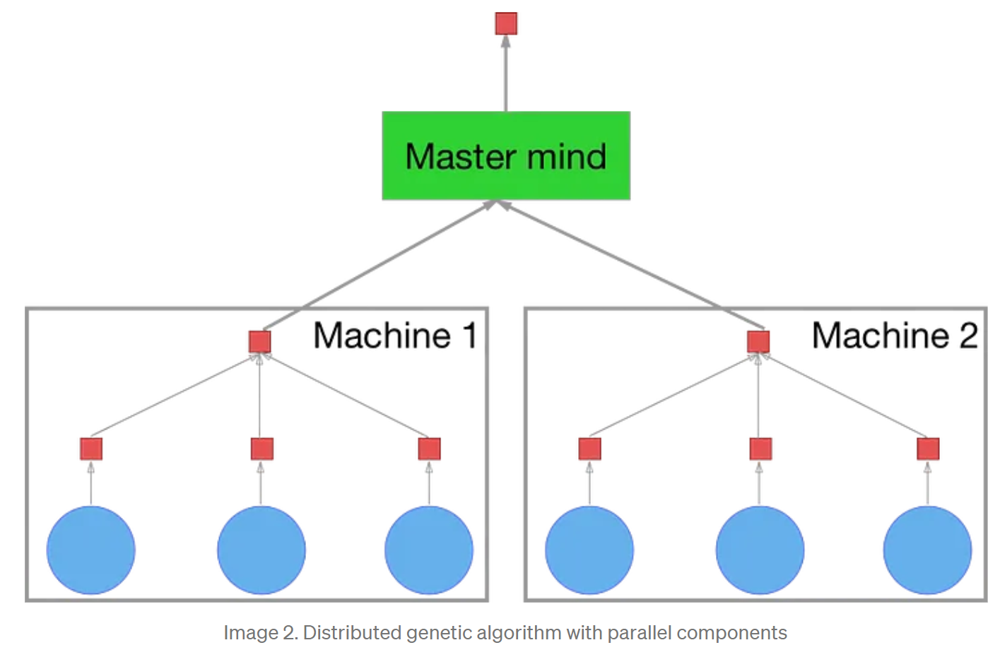

# 🧬 Distributed Genetic Algorithm with Jade
## Under development... 🚀
## 📚 Table of Contents
- [📝 Overview](#-overview)
- [📁 Project Structure](#-project-structure)
- [📦 Dependencies](#-dependencies)
- [✅ Test](#-test)

## 📝 Overview
This project is a distributed genetic algorithm implementation using the [Jade](https://jade.tilab.com/) framework.
The distributed genetic algorithm is an algorithmic approach that involves the utilization of multiple genetic algorithms to address a shared task [1]. In this methodology, numerous algorithms are employed concurrently, all striving to solve the same problem. Once these algorithms have completed their individual tasks, the best individual from each algorithm is selected. Subsequently, the most exceptional individual among them is chosen as the ultimate solution to the problem at hand. This approach, often referred to as the "island model," represents one of the most popular strategies in the realm of distributed genetic algorithms, despite the existence of other approaches. The term "island model" stems from the analogy of isolating populations, similar to real-life creature populations residing on different islands.

This project is based on a previous project that includes all the details about the genetic algorithm implementation. You can find it [here](https://github.com/Slimani-CE/genetic-algorithm).

 [Image Source](https://towardsdatascience.com/parallel-and-distributed-genetic-algorithms-1ed2e76866e3)

## 📁 Project Structure
```
.
│   ConsoleApplication.java
│   GuiApplication.java
│
├───agents
│       IslandAgent.java
│       MasterAgent.java
│
├───containers
│       MainContainer.java
│       SimpleContainer.java
│
├───controllers
│       MasterGuiController.java
│
└───utils
        GAUtils.java
        Individual.java
        Population.java
        Solution.java
```

## 📦 Dependencies


## ✅ Test

